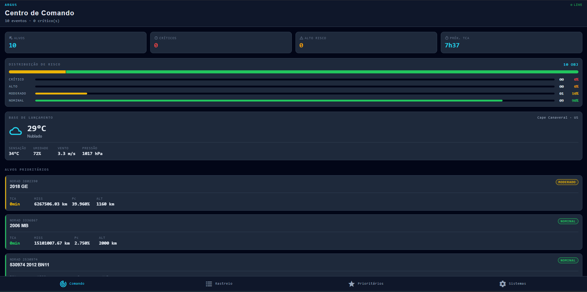
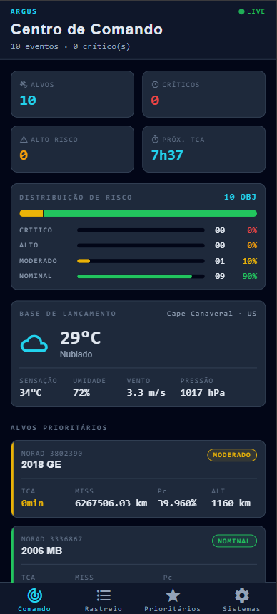
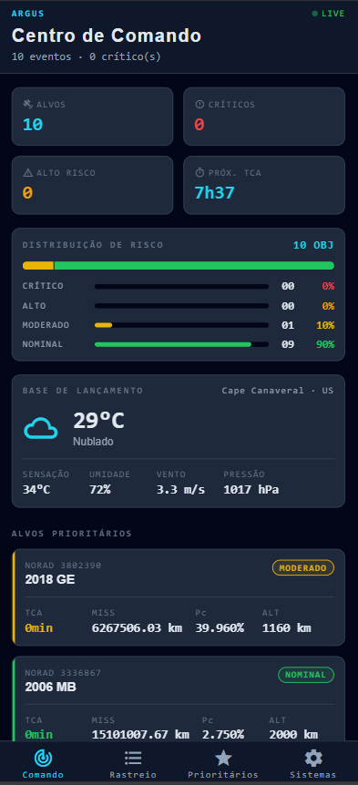
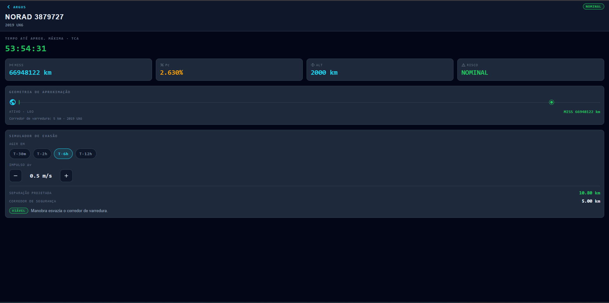

#  Argus: Sistema de Prevenção da Síndrome de Kessler

> Console tático móvel para **monitoramento e evasão de detritos espaciais** na órbita baixa da Terra (LEO).

Argus é uma aplicação mobile de infraestrutura crítica que consome dados orbitais e climáticos públicos, classifica o risco de colisão **no próprio dispositivo** e apresenta um painel de comando em tempo real para operadores. O objetivo é mitigar a **Síndrome de Kessler** — o cenário de colisões em cascata que tornaria a LEO inutilizável para satélites, comunicações e missões futuras.

Construído com identidade de **console de operações**: dark mode tático, tipografia monoespaçada para telemetria e codificação de severidade em âmbar/ciano/vermelho.

---

##  Inteligência simulada + APIs

O Argus integra duas APIs públicas através de uma **Service Layer** com Axios (cliente central, `baseURL`, timeout e interceptors que normalizam erros em `AppError`):

| Fonte | Uso |
|---|---|
| **NASA — Asteroids NeoWs** | Aproximações de objetos próximos à Terra (janela de 3 dias). |
| **OpenWeather — Current Weather** | Condições atmosféricas da base de lançamento (Cape Canaveral). |

**Classificação de risco (IA simulada).** O NeoWs não expõe indicadores de colisão prontos. Nesta entrega, o módulo [`nasaService.ts`](src/services/nasaService.ts) **calcula localmente** os indicadores — nível de risco, **TCA** (tempo até a aproximação máxima), **Pc** (probabilidade de colisão) e altitude projetada — a partir da distância mínima de aproximação e da velocidade relativa. Essa lógica (`classifyRisk`) é uma *simulação determinística* do que, em produção, seria um modelo de Machine Learning (Random Forest / Regressão Logística) rodando server-side.

**Simulador de evasão.** O mesmo princípio determinístico alimenta o **Simulador de Janela de Evasão** ([`utils/evasion.ts`](src/utils/evasion.ts)): a separação obtida por uma manobra (Δv × antecedência) é comparada a um **corredor de varredura**, espelhando a avaliação de conjunção (CDM) real — agir mais cedo ou com mais impulso amplia a separação projetada e leva o veredito de **INSUFICIENTE** a **VIÁVEL**.

**Arquitetura *plug-and-play*.** Toda a UI consome o tipo de domínio [`DebrisAlert`](src/types/telemetry.ts), nunca o JSON bruto da API. Isso isola o front-end: a troca futura do cálculo local por indicadores de ML calculados externamente não exige mudança nas telas.

---

##  ODS contemplados

- **ODS 9** — Indústria, inovação e infraestrutura
- **ODS 11** — Cidades e comunidades sustentáveis
- **ODS 13** — Ação contra a mudança do clima (sensoriamento remoto / clima)

---

##  Stack tecnológica

| Camada | Tecnologia |
|---|---|
| Mobile | React Native + Expo SDK 55 + TypeScript (`strict`) |
| Navegação | React Navigation — Native Stack + Bottom Tabs (rotas tipadas) |
| Estado global | Context API + Custom Hooks |
| Persistência local | AsyncStorage |
| Consumo de API | Axios (Service Layer) + interceptors |
| APIs externas | NASA NeoWs · OpenWeather |
| Visualização | Gráficos e diagramas customizados (Flexbox + Animated, **sem libs de terceiros**) |

---

##  Arquitetura de pastas

```txt
src/
 ├── components/    # Design System reutilizável (RiskChart, WeatherWidget, TacticalCard…)
 ├── screens/       # Home, Listagens, Favoritos, Configurações, Painel de Conjunção
 ├── navigation/    # stacks, tabs e tipagem de rotas
 ├── services/      # Service Layer (Axios, nasaService, weatherService)
 ├── hooks/         # custom hooks (useTelemetry, useWeather, useFavorites)
 ├── contexts/      # Context API (estado global)
 ├── storage/       # wrappers tipados de AsyncStorage
 ├── types/         # interfaces e types compartilhados
 ├── theme/         # tokens de cor, spacing, tipografia (dark)
 ├── utils/         # funções puras (classificação e agregação de risco)
 └── assets/        # imagens, ícones, fontes
```

---

##  Funcionalidades

- ** Home (Dashboard)** — painel de comando denso: resumo de alvos (total, críticos, alto risco, próximo TCA), **gráfico de distribuição de risco**, **widget climático da base de lançamento** e os alvos prioritários rastreados.
- ** Listagens** — catálogo orbital completo com **busca textual** (designação / NORAD), filtros por severidade e ordenação por TCA.
- ** Favoritos** — ativos prioritários salvos localmente (AsyncStorage), persistidos entre sessões, com **histórico de atividade recente** (toque para refavoritar / limpar).
- ** Configurações** — **alternância de tema dark/light** persistida em AsyncStorage, fonte de dados e versão.
- ** Painel de Conjunção** — toque em qualquer alvo (Home, Listagens ou Favoritos) para abrir o detalhe da aproximação: **contagem regressiva ao vivo** até o TCA, **geometria de aproximação** (diagrama Flexbox da distância ao corredor de varredura) e um **Simulador de Janela de Evasão** — ajuste a antecedência da manobra e o impulso Δv e veja na hora se a evasão esvazia o corredor de segurança (veredito **VIÁVEL / INSUFICIENTE**).

Toda tela que consome dados trata os estados **loading** (skeletons), **empty**, **error** (com retry) e **success**.

---

##  Instalação e execução

> Pré-requisitos: Node.js LTS e o app **Expo Go** (para rodar em um device físico) ou um emulador Android/iOS.

```bash
# 1. Instalar dependências
npm install

# 2. Configurar as chaves de API
#    Copie o exemplo e preencha com suas chaves (NASA + OpenWeather).
cp .env.example .env       # Windows (PowerShell): Copy-Item .env.example .env

# 3. Iniciar o servidor de desenvolvimento
npx expo start
```

No terminal do Expo, escolha a plataforma:

- **`w`** → Web
- **`a`** → Android (emulador ou device via Expo Go)
- **`i`** → iOS (simulador ou device via Expo Go)

> **Chaves de API:** gere a da NASA em <https://api.nasa.gov/> e a do OpenWeather em <https://openweathermap.org/api>. Sem a chave da NASA o app usa o `DEMO_KEY` (com limite agressivo de requisições); sem a do OpenWeather o widget climático exibe um estado de erro com opção de recarregar.

---

##  Capturas de tela

> _Operador: coloque os PNGs em `docs/screenshots/`. Os caminhos abaixo já estão demarcados no formato `` — basta soltar os arquivos para que as imagens renderizem._

###  Web


###  Android


###  iOS


###  Painel de Conjunção


---

##  Integrantes

| Integrante | RM |
|---|---|
| Italo Caliari Silva | RM554758 |
| Júlio César Ruiz Zequin | RM554676 |
| Danilo Gronski Wendler | RM556602 |
| Pedro Henrique Muzel Santos | RM555983 |
| Vitor Montemor Ismael | RM556027 |

---

>  O repositório **não contém a pasta `node_modules`** (garantido via `.gitignore`). Rode `npm install` antes de iniciar.
